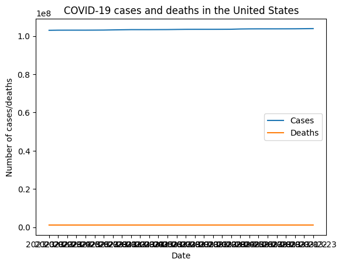
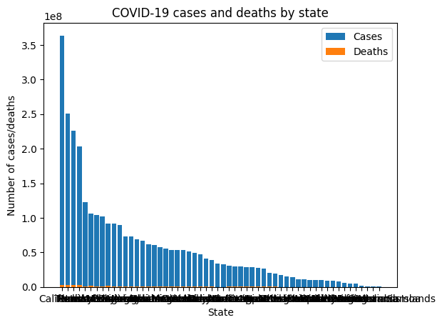

HW 6, CS 625, Spring 2023
================
Navya Teja Ogirala
Apr 2, 2023

#### Step 1 - Choosing a Dataset:

For my main dataset, I have chosen the “COVID-19 cases in the United
States by county” dataset provided by the New York Times, which can be
found at
\[<https://github.com/nytimes/covid-19-data/blob/master/us-counties-recent.csv>\].

#### EDA Process:

- **Data Description:**

  I am interested in analyzing the spread and severity of COVID-19
  across different counties in the United States. COVID-19 has had a
  profound impact on the world, and I want to understand how it has
  affected different regions within the US. The dataset has 6 columns,
  including the date, county, state, fips, cases and, death. The data is
  updated daily, which allows me to explore how the COVID-19 situation
  changes over time.

- **EDA Process:**

  To start my EDA process, I used Python and the pandas library to load
  the CSV file into a pandas DataFrame. I then used various pandas
  functions to explore the dataset, such as the describe() function to
  get summary statistics of the data and the info() function to get a
  summary of the data types of each column. I also used the groupby()
  function to group the data by state and county and compute summary
  statistics for each group.

  Checked the dimensions of the dataset: the dataset has 97701 rows and
  6 columns.

      import pandas as pd
      county_data = pd.read_csv('us-counties-recent.csv')
      print(county_data.shape)

  Checked the data types of the columns: date is in date format,county
  is in object,state in object,fips in float64,cases in int64 and,
  deaths in float64.So, I changed the data column data type to datetime

      county_data.info()

  Checked for any missing values and found that there are few missing
  values in fips and death column and few zero values in cases and
  deaths.

  Checked for duplicates: there are no duplicate rows in the dataset.

      county_data.groupby(['state','county']).first()
      import matplotlib.pyplot as plt
      x=county_data['cases']
      y=county_data['deaths']
      plt.plot(x,y)
      plt.show()

  Next, I created some charts in Tableau to get a better understanding
  of the data.I plotted graphs about the cases and deaths against
  states.

Below is the google collab
link:\[<https://colab.research.google.com/drive/1YEGRWwFpuZJZqZGPHHST455tKBcLZggp?authuser=2#scrollTo=MPrXS8p9D6RP>\]

Below are the plots obtained from Tableau:

 

Line charts are plotted with state,cases and deaths as attributes. Marks
used were x,y axis. Channels used were lines.

- **Proposed Questions:**

  1.How has the COVID-19 situation changed in the United States over
  time, and what are the current trends in cases and deaths?

<!-- -->

    import matplotlib.pyplot as plt
    # Grouping the data by date
    county_data_date = county_data.groupby('date').sum()

    # Plotting number of cases and deaths over time
    plt.plot(county_data_date.index, county_data_date['cases'], label='Cases')
    plt.plot(county_data_date.index, county_data_date['deaths'], label='Deaths')
    plt.xlabel('Date')
    plt.ylabel('Number of cases/deaths')
    plt.title('COVID-19 cases and deaths in the United States')
    plt.legend()
    plt.show()

For plotting the grpah to find the current trend in cases and deaths I
use google colab.

Attributes used were date on x-axis, number of cases and deaths on
y-axis. Marks are line, channels are : x,y axis positions.

2.Are there any states or counties that have been hit particularly hard
by COVID-19, and what factors might be contributing to this?

    # Grouping data by state and compute total number of cases and deaths
    county_state = county_data.groupby('state').sum()
    county_state = county_state.sort_values(by='cases', ascending=False)

    # Plotting number of cases and deaths by state
    plt.bar(county_state.index, county_state['cases'], label='Cases')
    plt.bar(county_state.index, county_state['deaths'], label='Deaths')
    plt.xlabel('State')
    plt.ylabel('Number of cases/deaths')
    plt.title('COVID-19 cases and deaths by state')
    plt.legend()
    plt.show()

Attributes used were state on x-axis, number of cases and deaths on
y-axis. Marks are bars, channels are : x,y axis positions, length or
height (to represent the number of cases and deaths.

To visualize both the questions efficiently, color channel, labels is
used to differentiate between deaths and cases.

Overall, this initial EDA process allowed me to get a better
understanding of the COVID-19 dataset and generated some initial
questions that I will explore further in HW7 and HW8.

##### References

- <https://r4ds.had.co.nz/exploratory-data-analysis.html>
- <https://pandas.pydata.org/docs/>
- <https://matplotlib.org/stable/users/index.html>
- <https://github.com/nytimes/covid-19-data/blob/master/us-counties-recent.csv>
