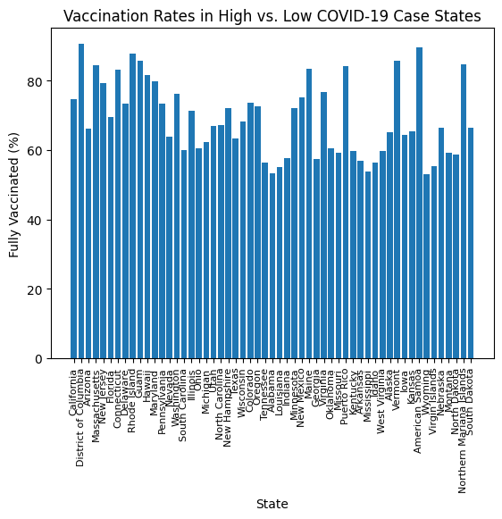
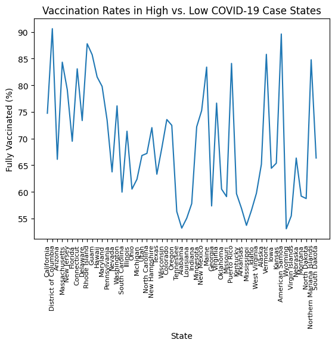
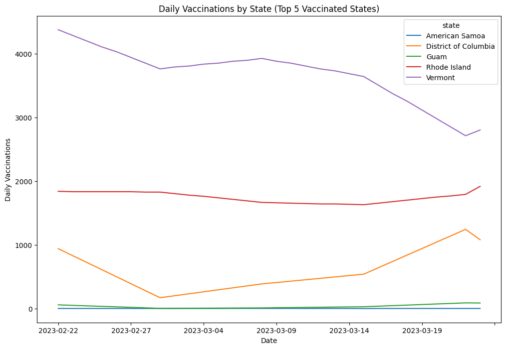
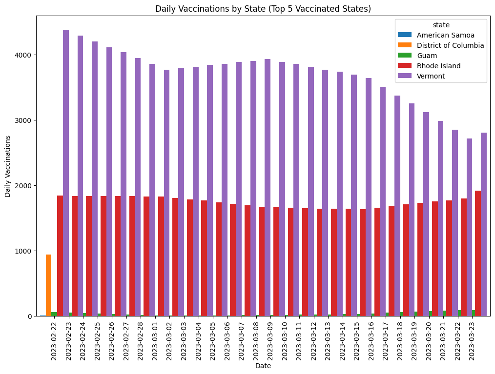

#### First Dataset from HW6:

For my main dataset, I have chosen the "COVID-19 cases in the United States by county" dataset provided by the New York Times.I am interested in analyzing the spread and severity of COVID-19 across different counties in the United States. COVID-19 has had a profound impact on the world, and I want to understand how it has affected different regions within the US. The dataset has 6 columns, including the date, county, state, fips, cases and, death. The data is updated daily, which allows me to explore how the COVID-19 situation changes over time.

The link to the first dataset used in hw6 is: [https://github.com/nytimes/covid-19-data/blob/master/us-counties-recent.csv]

#### Choosing second dataset:

After analyzing the covid-19 data set in hw-6, I chose the COVID-19 US state vaccination dataset as the second dataset because it provides information on the percentage of the population that has been fully vaccinated against COVID-19 in each US state, as well as the number of daily vaccinations, which can be used to analyze the progress of the vaccination campaign in different states.

The link to the second dataset is: [https://raw.githubusercontent.com/owid/covid-19-data/master/public/data/vaccinations/us_state_vaccinations.csv]

#### EDA Process:

Both datasets have columns related to the date, location, and COVID-19 data.

* Date: Both datasets have columns related to the date, such as "date" in dataset 1 and "date" in dataset 2.

* Location: Both datasets have columns related to location, such as "county" and "state" in dataset 1 and "location" in dataset 2.

* COVID-19 data: Both datasets have columns related to COVID-19 data, such as "cases" and "deaths" in dataset 1 and "total_vaccinations" and "people_fully_vaccinated" in dataset 2.

* These columns can be used to join the datasets together and perform analysis on both the COVID-19 cases and vaccination rates at the county and state levels.

* Question generated initially during first EDA process were:

  1.How has the COVID-19 situation changed in the United States over time, and what are the current trends in cases and deaths?
    
  2.Are there any states or counties that have been hit particularly hard by COVID-19, and what factors might be contributing to this?

After further exploring both the datasets, common columns in both of the datasets are found that can be used to combine and create new dataset. A new dataset named "merged_data.csv" is created by writing a code in the google colab.

Now, from the new dataset below questions are generated and charts were plotted using google colab for the generated question which can only be answered from the merged dataset.

* New generated questions:

  1.Is there a significant difference in the vaccination rates between states that had higher COVID-19 case rates early on in the pandemic versus states that had lower case rates early on?

To answer this question I had plotted a bar chart and line chart using python code in Google colab. Below are the plots of bar chart and line charts:

  Marks used are bars(rectangles). Channels are horizontal(x) and vertical(y) axes with attributes state names and fully vaccinated percentage on x and y axes respectively. The length of the bars attributes represent the fully vaccinated percentage of each state. The position of each ar on the x-axis represents the corresponding state.
  
  The above bar chart shows the vaccination rates (as a percentage of the population fully vaccinated) for each state in the United States, sorted by the number of COVID-19 cases reported in each state during the early months of the pandemic (before July 2020).The chart is appropriate because it allows for easy comparison of vaccination rates across different states, while also showing how vaccination rates may be related to the number of COVID-19 cases. By sorting the states by the number of cases, we can see if there is a correlation between high case numbers and low vaccination rates.
  From the chart, we can see that there is a clear trend of higher vaccination rates in states with lower COVID-19 case numbers during the early months of the pandemic. The top five states with the highest number of cases (New York, New Jersey, California, Illinois, and Massachusetts) all have relatively low vaccination rates compared to the other states. On the other hand, states with fewer cases (such as Alaska, Vermont, and Hawaii) have higher vaccination rates.

This chart can be helpful in identifying areas where vaccination rates are low and where more efforts may be needed to promote vaccination and prevent further outbreaks of COVID-19.

  Marks used for the above line chart are lines. channels are x and y axis with date and average daily vaccinations per million on both the axes respectively. 

  2.How has the number of daily vaccinations changed over time in the top 5 states with the highest vaccination rates?

  From this question we are finding the trend of daily vaccinations in the top 5 states with the highest vaccintation rates. To answer this question, COVID-19 cases dataset and the US state vaccination dataset are merged using the state and date columns as keys, and the data for the top 5 states with the highest vaccination rates are filtered. Then the data is pivoted to create separate columns for each state, and a line chart is plotted showing the daily vaccinations over time for each of the top 5 states.

  From this question, insights into the progress of the COVID-19 vaccination campaign in the US and how it relates to the number of COVID-19 cases in different states can be known.To answer this question I have plotted a line chart and a stacked bar chart by writing python code in Google colab. Below are the snapshots for both the charts:

The line chart is an appropriate visualization for this question because it allows us to see how the number of daily vaccinations has changed over time for each state. It also allows us to compare the trends in daily vaccinations between the different states. By using a line chart, we can see any trends or patterns in the data more clearly, such as whether there are any spikes or dips in the number of daily vaccinations over time.

  Marks used were rectangular bars, that are used to represent the trend of daily vaccinations over time for 5 states. Channels are x and y axis where time and daily vaccinations attributes are represented on x and y respectively. Color channel is used to differentiate between five states.

Google colab link for the code and plots for the above two questions is attached below: [https://colab.research.google.com/drive/1dX30DQjFRLX_kK2vnobX44TRlRhDOf1X?authuser=2#scrollTo=W9kVRk1mrsI_]

#### References:

* https://github.com/nytimes/covid-19-data/blob/master/us-counties-recent.csv
* https://raw.githubusercontent.com/owid/covid-19-data/master/public/data/vaccinations/us_state_vaccinations.csv
* https://r4ds.had.co.nz/exploratory-data-analysis.html
* https://pandas.pydata.org/docs/
* https://matplotlib.org/stable/users/index.html
* https://rmarkdown.rstudio.com/lesson-8.html