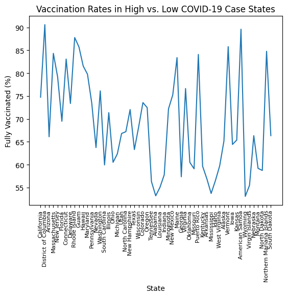
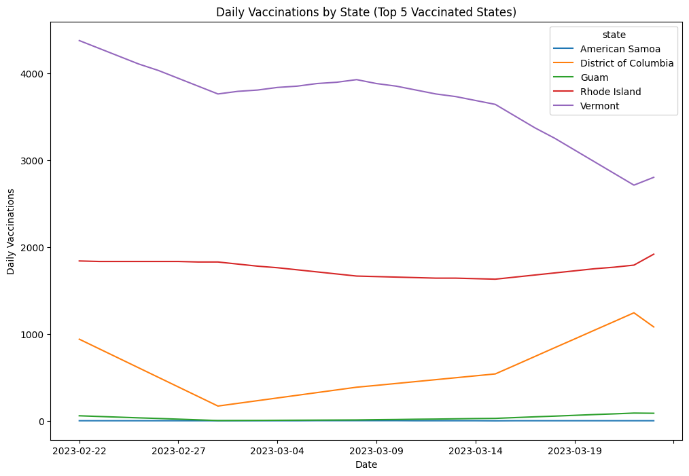
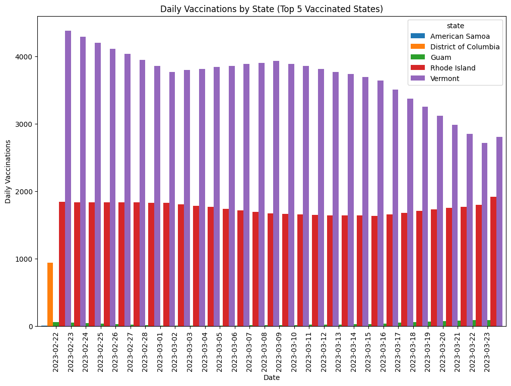

HW 7, CS 625, Spring 2023
================
Navya Teja Ogirala
Apr 13, 2023

#### First Dataset from HW6:

For my main dataset, I have chosen the “COVID-19 cases in the United
States by county” dataset provided by the New York Times.I am interested
in analyzing the spread and severity of COVID-19 across different
counties in the United States. COVID-19 has had a profound impact on the
world, and I want to understand how it has affected different regions
within the US. The dataset has 6 columns, including the date, county,
state, fips, cases and, death. The data is updated daily, which allows
me to explore how the COVID-19 situation changes over time.

The link to the first dataset used in hw6 is:
\[<https://github.com/nytimes/covid-19-data/blob/master/us-counties-recent.csv>\]

#### Choosing second dataset:

After analyzing the covid-19 data set in hw-6, I chose the COVID-19 US
state vaccination dataset as the second dataset because it provides
information on the percentage of the population that has been fully
vaccinated against COVID-19 in each US state, as well as the number of
daily vaccinations, which can be used to analyze the progress of the
vaccination campaign in different states.

The link to the second dataset is:
\[<https://raw.githubusercontent.com/owid/covid-19-data/master/public/data/vaccinations/us_state_vaccinations.csv>\]

#### EDA Process:

Both datasets have columns related to the date, location, and COVID-19
data.

- Date: Both datasets have columns related to the date, such as “date”
  in dataset 1 and “date” in dataset 2.

- Location: Both datasets have columns related to location, such as
  “county” and “state” in dataset 1 and “location” in dataset 2.

- COVID-19 data: Both datasets have columns related to COVID-19 data,
  such as “cases” and “deaths” in dataset 1 and “total_vaccinations” and
  “people_fully_vaccinated” in dataset 2.

- These columns can be used to join the datasets together and perform
  analysis on both the COVID-19 cases and vaccination rates at the
  county and state levels.

- Question generated initially during first EDA process were:

  1.How has the COVID-19 situation changed in the United States over
  time, and what are the current trends in cases and deaths?

  2.Are there any states or counties that have been hit particularly
  hard by COVID-19, and what factors might be contributing to this?

After further exploring both the datasets, common columns in both of the
datasets are found that can be used to combine and create new dataset. A
new dataset named “merged_data.csv” is created by writing a code in the
google colab.

Now, from the new dataset below questions are generated and charts were
plotted using google colab for the generated question which can only be
answered from the merged dataset.

- New generated questions:

  1.Is there a significant difference in the vaccination rates between
  states that had higher COVID-19 case rates early on in the pandemic
  versus states that had lower case rates early on?

To answer this question I had plotted a bar chart and line chart using
python code in Google colab. Below are the plots of bar chart and line
charts:

Marks used are bars(rectangles). Channels are horizontal(x) and
vertical(y) axes with attributes state names and fully vaccinated
percentage on x and y axes respectively. The length of the bars
attributes represent the fully vaccinated percentage of each state. The
position of each ar on the x-axis represents the corresponding state.

The above bar chart shows the vaccination rates (as a percentage of the
population fully vaccinated) for each state in the United States, sorted
by the number of COVID-19 cases reported in each state during the early
months of the pandemic (before July 2020).The chart is appropriate
because it allows for easy comparison of vaccination rates across
different states, while also showing how vaccination rates may be
related to the number of COVID-19 cases. By sorting the states by the
number of cases, we can see if there is a correlation between high case
numbers and low vaccination rates. From the chart, we can see that there
is a clear trend of higher vaccination rates in states with lower
COVID-19 case numbers during the early months of the pandemic. The top
five states with the highest number of cases (New York, New Jersey,
California, Illinois, and Massachusetts) all have relatively low
vaccination rates compared to the other states. On the other hand,
states with fewer cases (such as Alaska, Vermont, and Hawaii) have
higher vaccination rates.

This chart can be helpful in identifying areas where vaccination rates
are low and where more efforts may be needed to promote vaccination and
prevent further outbreaks of COVID-19.

Marks used for the above line chart are lines. channels are x and y axis
with date and average daily vaccinations per million on both the axes
respectively.

2.How has the number of daily vaccinations changed over time in the top
5 states with the highest vaccination rates?

From this question we are finding the trend of daily vaccinations in the
top 5 states with the highest vaccintation rates. To answer this
question, COVID-19 cases dataset and the US state vaccination dataset
are merged using the state and date columns as keys, and the data for
the top 5 states with the highest vaccination rates are filtered. Then
the data is pivoted to create separate columns for each state, and a
line chart is plotted showing the daily vaccinations over time for each
of the top 5 states.

From this question, insights into the progress of the COVID-19
vaccination campaign in the US and how it relates to the number of
COVID-19 cases in different states can be known.To answer this question
I have plotted a line chart and a stacked bar chart by writing python
code in Google colab. Below are the snapshots for both the charts:

The line chart is an appropriate visualization for this question because
it allows us to see how the number of daily vaccinations has changed
over time for each state. It also allows us to compare the trends in
daily vaccinations between the different states. By using a line chart,
we can see any trends or patterns in the data more clearly, such as
whether there are any spikes or dips in the number of daily vaccinations
over time.

Marks used were rectangular bars, that are used to represent the trend
of daily vaccinations over time for 5 states. Channels are x and y axis
where time and daily vaccinations attributes are represented on x and y
respectively. Color channel is used to differentiate between five
states.

Google colab link for the code and plots for the above two questions is
attached below:
\[<https://colab.research.google.com/drive/1dX30DQjFRLX_kK2vnobX44TRlRhDOf1X?authuser=2#scrollTo=W9kVRk1mrsI_>\]

#### References:

- <https://github.com/nytimes/covid-19-data/blob/master/us-counties-recent.csv>
- <https://raw.githubusercontent.com/owid/covid-19-data/master/public/data/vaccinations/us_state_vaccinations.csv>
- <https://r4ds.had.co.nz/exploratory-data-analysis.html>
- <https://pandas.pydata.org/docs/>
- <https://matplotlib.org/stable/users/index.html>
- <https://rmarkdown.rstudio.com/lesson-8.html>
