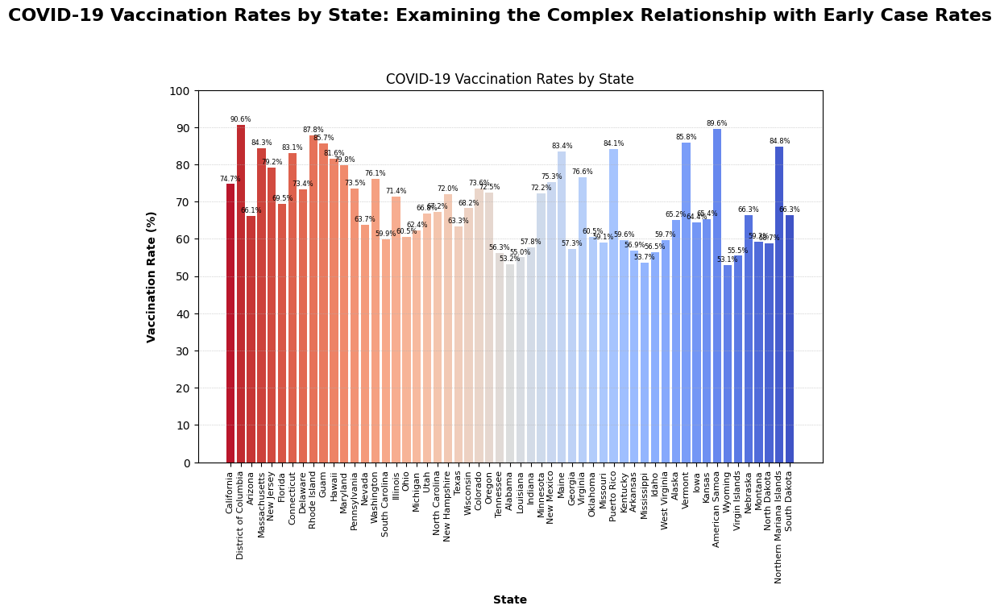

### Final chart implementation:

**Dataset Explanation**:

The datasets I have chosen for hw6-hw8 are Covid-19 datasets for the states in the US. I have chosen two datasets which has cases,death and vaccination data across all the states in the US. I wanted to find out the trend in the Covid case with the vaccination rates. Below are the links for datasets

Dataset1: [https://github.com/nytimes/covid-19-data/blob/master/us-counties-recent.csv]

Dataset2:[https://raw.githubusercontent.com/owid/covid-19-data/master/public/data/vaccinations/us_state_vaccinations.csv]

**Refining proposed charts**:

Below are the two questions that I have generated in hw7:

1.Is there a significant difference in the vaccination rates between states that had higher COVID-19 case rates early on in the pandemic versus states that had lower case rates early on?

I have plotted a bar chart and a line graph for the above question.

2.How has the number of daily vaccinations changed over time in the top 5 states with the highest vaccination rates?

For this question I have plotted stacked bar graph and a line chart.

For HW8, I have chosen to select the bar chart plotted for question1. The bar chart for question1 shows the vaccination rates (as a percentage of the population fully vaccinated) for each state in the United States, sorted by the number of COVID-19 cases reported in each state during the early months of the pandemic (before July 2020).

Below is the initially plotted bar chart:

Final refined chart is below:

**Explanation of final chart:**

The bar graph depicts the vaccination rates in states that had higher COVID-19 case rates early on in the pandemic compared to states that had lower case rates. The data is based on the average vaccination rates calculated from the merged dataset of COVID-19 cases and vaccination data for each state.

Marks used are bars(rectangles). Channels are horizontal(x) and vertical(y) axes with attributes state names and fully vaccinated percentage on x and y axes respectively. The length of the bars attributes represent the fully vaccinated percentage of each state. The position of each ar on the x-axis represents the corresponding state.Color channel is used to represent states.

The headline I have chosen to the above graph is: 

**COVID-19 Vaccination Rates by State: Examining the Complex Relationship with Early Case Rates**

"COVID-19 Vaccination Rates by State: Examining the Complex Relationship with Early Case Rates" is a more appropriate headline for the chart because it accurately summarizes the main finding depicted in the visualization. It highlights the relationship between vaccination rates and COVID-19 case rates early on in the pandemic. This headline provides a clear and concise message that aligns with the chart's purpose and content.

Below is the google colab link for the above plotted chart:[https://colab.research.google.com/drive/1vRKgdAV_PYOVGWBzE-PnxjBsDW1GIxAL?usp=sharing]

**Design Decisions Made in Transforming from the Draft to the Refined Chart:**

*Set up figure and axes:* Instead of using the default figure and axes from Matplotlib, the refined code creates a figure and axes object explicitly using fig, ax = plt.subplots(figsize=(10, 6)) giving a more defined bar size changing options.

*Customized bar chart appearance:* The refined code uses the defined color palette from Seaborn to color-code the bars in the bar chart using the color parameter of the bar() function. This makes the plot more visually appealing and easier to interpret.

*Added data labels:* The refined code adds data labels outside the bars of the bar chart using the ax.annotate() function. This provides additional information about the vaccination rates and improves the readability of the plot.

*Customized x-axis label rotation and font size:* The x-axis labels are rotated 90 degrees to prevent overlapping using the ax.tick_params() function with rotation=90. Additionally, the font size of the x-axis labels is set to 8 using labelsize=8.

*Added grid lines:* Grid lines are added to the y-axis of the plot using the ax.grid() function. This helps in better understanding the values on the y-axis and improves the overall appearance of the plot.

*Customized x-axis and y-axis labels:* The x-axis and y-axis labels are customized with bold font weight, increased font size, and added label padding using the ax.set_xlabel(), ax.set_ylabel(), and labelpad parameter. This enhances the readability and aesthetics of the plot.

*Added title with custom font size and style*: A title is added to the plot using the ax.set_title() function with custom font size and bold font weight. This provides a clear and visually appealing title for the plot.

By adding these code changes the bar chart is made more visually appealing, readable and informative for the readers.

**Key Findings:** States with lower COVID-19 case rates early on in the pandemic have higher vaccination rates, with a higher percentage of people fully vaccinated compared to states with higher case rates.
This suggests that states with higher initial case rates may have implemented more aggressive vaccination campaigns to curb the spread of the virus.
Vaccination plays a critical role in reducing the impact of the pandemic, and states with lower case rates have made significant progress in vaccinating their population to protect against COVID-19.

**Annotations:** The chart is sorted in descending order based on COVID-19 cases early on, with states with higher case rates on the left and states with lower case rates on the right for easy comparison.
The x-axis is labeled with states, rotated for readability, and the y-axis represents the percentage of people fully vaccinated.
The chart uses contrasting colors for easy visualization and includes a title that summarizes the main point of the chart.
Additional annotations or context can be added as needed to provide further insights or explanations of the data.

**visualization principles incorporated:**

The following visualization principles from the semester were incorporated into the final visualization:

Use of Appropriate Chart Type: A bar chart was chosen for this visualization as it is suitable for comparing values of a categorical variable (states) and a quantitative variable (vaccination rates).

Color Palette: A color palette was carefully selected to ensure that the colors used in the chart are visually appealing and easily distinguishable from each other.The coolwarm color palette used in the refined chart effectively conveys the variation in vaccination rates among different states.

Data Labels: Data labels were added to provide precise information about the vaccination rates for each state

Grid Lines: Horizontal grid lines were added to the chart using the ax.grid() function with appropriate settings for line style and width. Grid lines provide a visual reference for interpreting the values on the y-axis and help to align the bars vertically.

Font Size and Style: Custom font size and style were applied to the x-axis and y-axis labels, as well as the chart title, using the fontsize and fontweight parameters in the ax.set_xlabel(), ax.set_ylabel(), and ax.set_title() functions, respectively. This helps to make the text more legible and visually appealing.

Tick Rotation: The x-axis tick labels were rotated by 90 degrees using the ax.tick_params() function with the rotation parameter set to 90. This prevents the tick labels from overlapping and improves their readability.

Y-Axis Ticks: Custom y-axis ticks were set to multiples of 10 using the ax.set_yticks() function. This helps to provide a clear and consistent scale for interpreting the vaccination rate values.

**Final thoughts:**

In terms of the assignment structure, splitting the assignment into three separate assignments (HW6, HW7, and HW8) was helpful as it allowed for a progressive and iterative development process. Each assignment built upon the previous one, allowing for refinement and improvement in each step. This approach also helped in better understanding the visualization principles and applying them effectively in the final visualization. Overall, the process took approximately 2-3 hours, with the most time-consuming aspects being the customization of font size and style, as well as fine-tuning the positioning of data labels on the bars in creating final chart for hw8. But the number of hours spent on hw6 and hw7 are more because of data selection and merging the two datasets to create two new questions from the chart.

#### References:

* https://github.com/nytimes/covid-19-data/blob/master/us-counties-recent.csv
* https://raw.githubusercontent.com/owid/covid-19-data/master/public/data/vaccinations/us_state_vaccinations.csv
* https://r4ds.had.co.nz/exploratory-data-analysis.html
* https://pandas.pydata.org/docs/
* https://matplotlib.org/stable/users/index.html
* https://rmarkdown.rstudio.com/lesson-8.html
* https://vis4.net/blog/posts/color-palette-selection/
