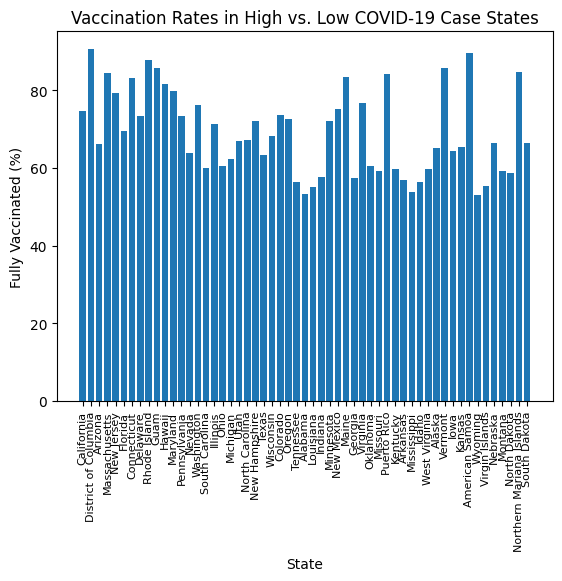
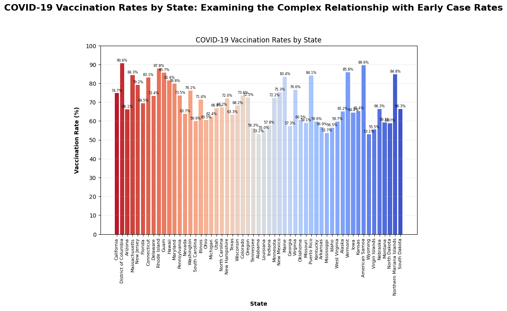

HW 8, CS 625, Spring 2023
================
Navya Teja Ogirala
Apr 20, 2023

### Final chart implementation:

**Dataset Explanation**:

The datasets I have chosen for hw6-hw8 are Covid-19 datasets for the
states in the US. I have chosen two datasets which has cases,death and
vaccination data across all the states in the US. I wanted to find out
the trend in the Covid case with the vaccination rates. Below are the
links for datasets

Dataset1:
\[<https://github.com/nytimes/covid-19-data/blob/master/us-counties-recent.csv>\]

Dataset2:\[<https://raw.githubusercontent.com/owid/covid-19-data/master/public/data/vaccinations/us_state_vaccinations.csv>\]

**Refining proposed charts**:

Below are the two questions that I have generated in hw7:

1.Is there a significant difference in the vaccination rates between
states that had higher COVID-19 case rates early on in the pandemic
versus states that had lower case rates early on?

I have plotted a bar chart and a line graph for the above question.

2.How has the number of daily vaccinations changed over time in the top
5 states with the highest vaccination rates?

For this question I have plotted stacked bar graph and a line chart.

For HW8, I have chosen to select the bar chart plotted for question1.
The bar chart for question1 shows the vaccination rates (as a percentage
of the population fully vaccinated) for each state in the United States,
sorted by the number of COVID-19 cases reported in each state during the
early months of the pandemic (before July 2020).

Below is the initially plotted bar chart: 

Final refined chart is below: 

**Explanation of final chart:**

The bar graph depicts the vaccination rates in states that had higher
COVID-19 case rates early on in the pandemic compared to states that had
lower case rates. The data is based on the average vaccination rates
calculated from the merged dataset of COVID-19 cases and vaccination
data for each state.

Marks used are bars(rectangles). Channels are horizontal(x) and
vertical(y) axes with attributes state names and fully vaccinated
percentage on x and y axes respectively. The length of the bars
attributes represent the fully vaccinated percentage of each state. The
position of each ar on the x-axis represents the corresponding
state.Color channel is used to represent states.

The headline I have chosen to the above graph is:

**COVID-19 Vaccination Rates by State: Examining the Complex
Relationship with Early Case Rates**

“COVID-19 Vaccination Rates by State: Examining the Complex Relationship
with Early Case Rates” is a more appropriate headline for the chart
because it accurately summarizes the main finding depicted in the
visualization. It highlights the relationship between vaccination rates
and COVID-19 case rates early on in the pandemic. This headline provides
a clear and concise message that aligns with the chart’s purpose and
content.

Below is the google colab link for the above plotted
<<<<<<< HEAD
chart:\[<https://colab.research.google.com/drive/1vRKgdAV_PYOVGWBzE-PnxjBsDW1GIxAL?usp=sharing>\]
=======
chart:\[https://colab.research.google.com/drive/1vRKgdAV_PYOVGWBzE-PnxjBsDW1GIxAL?usp=sharing\]
>>>>>>> 641bf01446c8207cdf40313451cc2bef77e0352d

**Design Decisions Made in Transforming from the Draft to the Refined
Chart:**

*Set up figure and axes:* Instead of using the default figure and axes
from Matplotlib, the refined code creates a figure and axes object
explicitly using fig, ax = plt.subplots(figsize=(10, 6)) giving a more
defined bar size changing options.

*Customized bar chart appearance:* The refined code uses the defined
color palette from Seaborn to color-code the bars in the bar chart using
the color parameter of the bar() function. This makes the plot more
visually appealing and easier to interpret.

*Added data labels:* The refined code adds data labels outside the bars
of the bar chart using the ax.annotate() function. This provides
additional information about the vaccination rates and improves the
readability of the plot.

*Customized x-axis label rotation and font size:* The x-axis labels are
rotated 90 degrees to prevent overlapping using the ax.tick_params()
function with rotation=90. Additionally, the font size of the x-axis
labels is set to 8 using labelsize=8.

*Added grid lines:* Grid lines are added to the y-axis of the plot using
the ax.grid() function. This helps in better understanding the values on
the y-axis and improves the overall appearance of the plot.

*Customized x-axis and y-axis labels:* The x-axis and y-axis labels are
customized with bold font weight, increased font size, and added label
padding using the ax.set_xlabel(), ax.set_ylabel(), and labelpad
parameter. This enhances the readability and aesthetics of the plot.

*Added title with custom font size and style*: A title is added to the
plot using the ax.set_title() function with custom font size and bold
font weight. This provides a clear and visually appealing title for the
plot.

By adding these code changes the bar chart is made more visually
appealing, readable and informative for the readers.

**Key Findings:** States with lower COVID-19 case rates early on in the
pandemic have higher vaccination rates, with a higher percentage of
people fully vaccinated compared to states with higher case rates. This
suggests that states with higher initial case rates may have implemented
more aggressive vaccination campaigns to curb the spread of the virus.
Vaccination plays a critical role in reducing the impact of the
pandemic, and states with lower case rates have made significant
progress in vaccinating their population to protect against COVID-19.

**Annotations:** The chart is sorted in descending order based on
COVID-19 cases early on, with states with higher case rates on the left
and states with lower case rates on the right for easy comparison. The
x-axis is labeled with states, rotated for readability, and the y-axis
represents the percentage of people fully vaccinated. The chart uses
contrasting colors for easy visualization and includes a title that
summarizes the main point of the chart. Additional annotations or
context can be added as needed to provide further insights or
explanations of the data.

**visualization principles incorporated:**

The following visualization principles from the semester were
incorporated into the final visualization:

Use of Appropriate Chart Type: A bar chart was chosen for this
visualization as it is suitable for comparing values of a categorical
variable (states) and a quantitative variable (vaccination rates).

Color Palette: A color palette was carefully selected to ensure that the
colors used in the chart are visually appealing and easily
distinguishable from each other.The coolwarm color palette used in the
refined chart effectively conveys the variation in vaccination rates
among different states.

Data Labels: Data labels were added to provide precise information about
the vaccination rates for each state

Grid Lines: Horizontal grid lines were added to the chart using the
ax.grid() function with appropriate settings for line style and width.
Grid lines provide a visual reference for interpreting the values on the
y-axis and help to align the bars vertically.

Font Size and Style: Custom font size and style were applied to the
x-axis and y-axis labels, as well as the chart title, using the fontsize
and fontweight parameters in the ax.set_xlabel(), ax.set_ylabel(), and
ax.set_title() functions, respectively. This helps to make the text more
legible and visually appealing.

Tick Rotation: The x-axis tick labels were rotated by 90 degrees using
the ax.tick_params() function with the rotation parameter set to 90.
This prevents the tick labels from overlapping and improves their
readability.

Y-Axis Ticks: Custom y-axis ticks were set to multiples of 10 using the
ax.set_yticks() function. This helps to provide a clear and consistent
scale for interpreting the vaccination rate values.

**Final thoughts:**

In terms of the assignment structure, splitting the assignment into
three separate assignments (HW6, HW7, and HW8) was helpful as it allowed
for a progressive and iterative development process. Each assignment
built upon the previous one, allowing for refinement and improvement in
each step. This approach also helped in better understanding the
visualization principles and applying them effectively in the final
visualization. Overall, the process took approximately 2-3 hours, with
the most time-consuming aspects being the customization of font size and
style, as well as fine-tuning the positioning of data labels on the bars
in creating final chart for hw8. But the number of hours spent on hw6
and hw7 are more because of data selection and merging the two datasets
to create two new questions from the chart.

#### References:

- <https://github.com/nytimes/covid-19-data/blob/master/us-counties-recent.csv>
- <https://raw.githubusercontent.com/owid/covid-19-data/master/public/data/vaccinations/us_state_vaccinations.csv>
- <https://r4ds.had.co.nz/exploratory-data-analysis.html>
- <https://pandas.pydata.org/docs/>
- <https://matplotlib.org/stable/users/index.html>
- <https://rmarkdown.rstudio.com/lesson-8.html>
- <https://vis4.net/blog/posts/color-palette-selection/>
